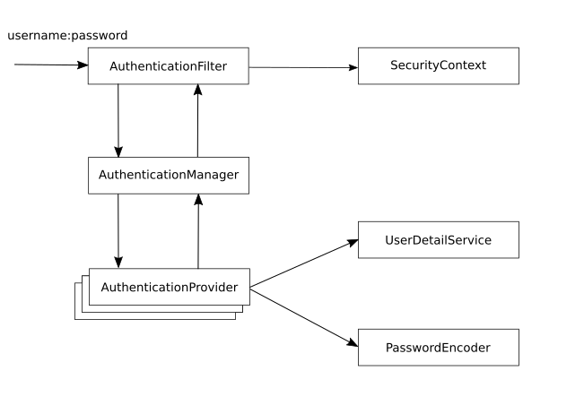

# Spring Security 
[TOC](./README.md)

##Lesson 1 - The basic contracts 

⭐ Timestamps ⭐
- 4:33 Spring boot project with Dependencies
- 17:44 Spring Security Architecture & Contracts
- 22:10 Sample Rest Controller w/ default spring boot configuration
- 29:00 HTTP Basic Auth / HTTP Authorization Header
- 43:00 Sample UserDetailsService Implementation
- 49:00 Sample PasswordEncoder Implementation

### Spring Architecture

When adding Spring Security to a project, simply by adding the dependency, Spring Boot Autoconfiguration will add
a security filter chain and secures an Appliaction with BasicAuthentication. The Username of the automatically created
user is `user` and the password is generated and will be printed to the logs.
Responsible for this is `org.springframework.boot.autoconfigure.security.servlet.UserDetailsServiceAutoConfiguration.class`
that configures an `InMemoryUserDetailsManager` as `UserDetailService` and creates a new user from security properties
( Properties starting with "spring.security.) read by `org.springframework.boot.autoconfigure.security.SecurityProperties.class`
.


Autoconfiguration is also responsible for creating a DefaultSecurityFilterChain with a BasicAuthenticationFilter.





_AuthenticationFilter_: `org.springframework.security.web.authentication.www.BasicAuthenticationFilter.class`

_AuthenticationManager_: `org.springframework.security.authentication.ProviderManager.class`

_AuthenticationProvier_: `org.springframework.security.authentication.dao.DaoAuthenticationProvider.class`
extends `org.springframework.security.authentication.dao.AbstractUserDetailsAuthenticationProvider.class`

_UserDetailService_: `InMemoryUserDetailsManager.class`

_PasswordEncoder_: `NoOpPasswordEncoder`


The Autoconfiguration will back off if one of the following classes are on the classpath
- AuthenticationManager.class,
- AuthenticationProvider.class,
- UserDetailsService.class, or
- AuthenticationManagerResolver.class

or one of the following types are available from the context
- org.springframework.security.oauth2.jwt.JwtDecoder,
- org.springframework.security.oauth2.server.resource.introspection.OpaqueTokenIntrospector,
- org.springframework.security.oauth2.client.registration.ClientRegistrationRepository

### Override Security Configuration

Configuration can be overridden with a configuration file and `UserDetailsServiceAutoConfiguration` will back off if an
UserDetailService is provided by the application.


A class implementing the `UserDetailsService` contract has to provide UserDetails, another contract that provides core
user information.

A user in Spring Security a user object has to follow the `UserDetails` contract. All the `is....` methods of that class
return `true` if the account is valid. Otherwise the methods return `false`

It's not sufficient to create a user with a password. The password has to be encoded. Therefore you either have
to provide a bean that implements `PasswordEncoder` contract or add an encoding hint (encodingId) to the password,
e.g. _"{noop}SuperSavePwd"_.


```java
public interface UserDetails extends Serializable {

	/**
	 * Returns the authorities granted to the user. Cannot return <code>null</code>.
	 */
	Collection<? extends GrantedAuthority> getAuthorities();

	/**
	 * Returns the password used to authenticate the user.
	 */
	String getPassword();

	/**
	 * Returns the username used to authenticate the user. Must return <code>null</code>.
	 * @return the username (never <code>null</code>)
	 */
	String getUsername();

	/**
	 * Indicates whether the user's account has expired. An expired account cannot be authenticated.
	 * @return <code>true</code> if the user's account is valid (ie non-expired),
	 * <code>false</code> if no longer valid (ie expired)
	 */
	boolean isAccountNonExpired();

	/**
	 * Indicates whether the user is locked or unlocked. A locked user cannot be
	 * authenticated.
	 * @return <code>true</code> if the user is not locked, <code>false</code> otherwise
	 */
	boolean isAccountNonLocked();

	/**
	 * Indicates whether the user's credentials (password) has expired. Expired
	 * credentials prevent authentication.
	 * @return <code>true</code> if the user's credentials are valid (ie non-expired),
	 * <code>false</code> if no longer valid (ie expired)
	 */
	boolean isCredentialsNonExpired();

	/**
	 * Indicates whether the user is enabled or disabled. A disabled user cannot be
	 * authenticated.
	 * @return <code>true</code> if the user is enabled, <code>false</code> otherwise
	 */
	boolean isEnabled();

}
```

[TOC](./README.md) 
