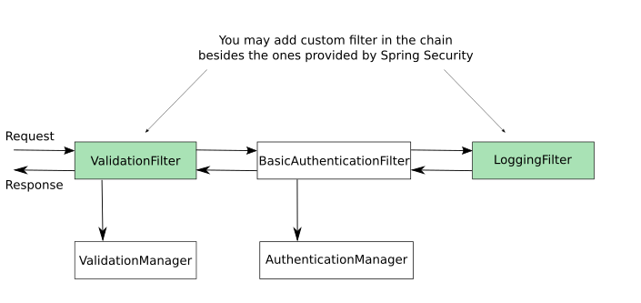
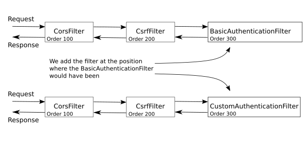

# Spring Security
[TOC](./README.md)

## Lesson 5 - The filter chain

⭐ Timestamps ⭐
- 1:00 Recap of Spring-security Architecture
- 4:30 Filter Chain Diagram
- 8:30 Creating Spring boot project with Dependencies
- 14:00 Custom Authentication Filter using Servlet Filter
- 24:00 Configure Authentication Manager in Config Class
- 34:20 Purpose of Security Context and what to store
- 36:15 Implementing Custom AuthenticationProvider
- 42:50 Configure Authentication Filter in Config Class & placement of filter wrt other filters
- 51:30 Proper http error response from Authentication Filter
- 53:00 Introduction - Custom Authentication Filter using spring security Filter class

This lesson starts with an overview over the filterchain and then starts with implementing a CustomAuthenticationFilter that implement the javax.servlet.Filter contract.
First thing is to cast the request parameter to a HttpServletFilter to get the authorization header from the
Afterwards the authorization key has been extracted is encapsulated into an Authencation object and delegated to an AuthenticationManager
The `UsernamePasswordAuthenticationToken` is chosen (misused) as Authentication to not have to implement a complete Authentication
class from scratch.

If authentication is successful the authentication has to be stored in the security context.

To add a filter to the Filterchain to have to overwrite the
`WebSecurityConfigurerAdapter.configure(HttopSecurity httpSecurity)'` method and add the filter.
A new filter can be added _before_, _after_ or at the position of another filter.
If the position of a filter isn't important httpSecurity.addFilter(filter) method is sufficient, but that happens rarely.

But wait, there is room for import. Instead of defining a custom filter that implements `Filter` interface
it's possible to extend the `org.springframework.web.filter.OncePerRequestFilter. In this case no casting is needed
an spring takes care that the ist is called only once per request. 

[TOC](./README.md)
