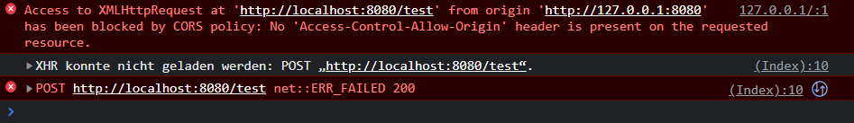
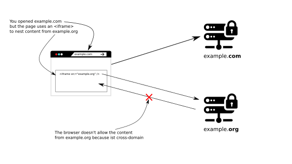
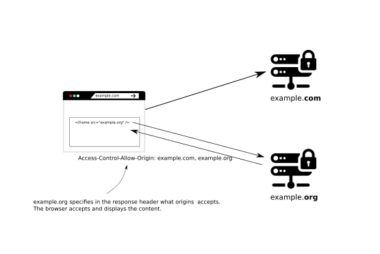
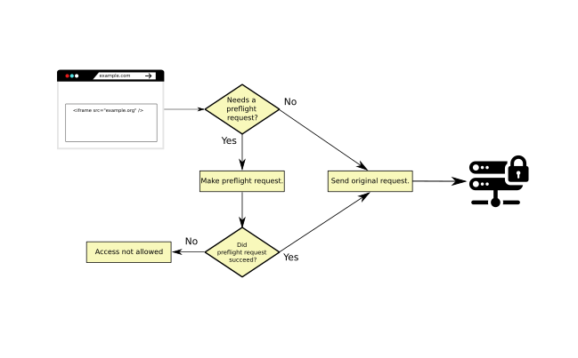

# Spring Security
[TOC](./README.md)

## Lesson 10 - CORS (Cross-Origin Resource Sharing)

⭐ Timestamps ⭐
- 2:22 CORS
- 21:00 QA on Controller vs Rest Controller
- 28:00 what CORS can't protect as opp. to CSRF
- 35:00 How to relax CORS for some Origins
- 47:35 CORS Summary, It protects Client, not Server(ie Website2)

There are different ways to deal with Cross Origin Resource Sharing, but before diving into it. Here is the definition
from wikipedia

_Cross-origin resource sharing (CORS) is a mechanism that allows restricted resources on a web page to be requested from another domain outside the domain from which the first resource was served._

When you try to access the same website with different addresses (, and this may only be an IP-Address and domain name for the same server)
you geht a CORS error message in the browser.



The reason for this is, that the Same-Origin-Policy is violated by the call to another website (or the same website with different addresses).

But this does not mean, that the method is not called! As can be seen by the POST- example in the `MainController`, the
method is executed but the response of the message ist blocked by the server.
So you won't get a server-side notification about CORS, because the user is allowed here to call the POST method, but the
the browser reacts to the wrong call.
To stop the user from calling the method you shoud not disable CSRF Protection.










### How to work around CORS errors

One way to allow a client to call a method, you can add a ***@CrossOrigin("\*")*** Annotation either to the controller
class or a method in the controller class. That way the **Access-Control-Allow-Origin** Header. The star is a placeholder
for all origins.

After adding the Annotation you will find the **Access-Control-Allow-Origin** Header in the browser response

This option is not really very secure, handy and is by no means configurable. In a real world scenario you should be able
to configure the allowed origins.

A much better option is to configure CORS from the WebSecurityConfigurerAdapter with a custom configuration as you already
did with the CSRF configuration in the previous lesson.

```java
    http.cors( c-> {
        CorsConfigurationSource ccs = request -> {
            CorsConfiguration cc = new CorsConfiguration();
            cc.setAllowedMethods(List.of("GET", "POST", "PUT", "DELETE"));
            cc.setAllowedOrigins(List.of("*"));
            return  cc;
        };
    });
```
Bear in mind, that you have to set not only the **allowed origins** but also the **allowed methods**
With this configurer your also able to load the value from the properties or from environment values.

The  **allowed origins** should contain the address of origin the

```java
    @Value("${chapter10.allowed.origins}")
    private List<String> allowedOrigins;

    http.cors( c-> {
        CorsConfigurationSource ccs = request -> {
            CorsConfiguration cc = new CorsConfiguration();
            cc.setAllowedMethods(List.of("GET", "POST", "PUT", "DELETE"));
            cc.setAllowedOrigins(allowedOrigins);
            return  cc;
        };
    });
```


See also: [CORS: Cross-Origin Resource Sharing erklärt](https://www.ionos.de/digitalguide/websites/web-entwicklung/cross-origin-resource-sharing-erklaert/)

[TOC](./README.md)
