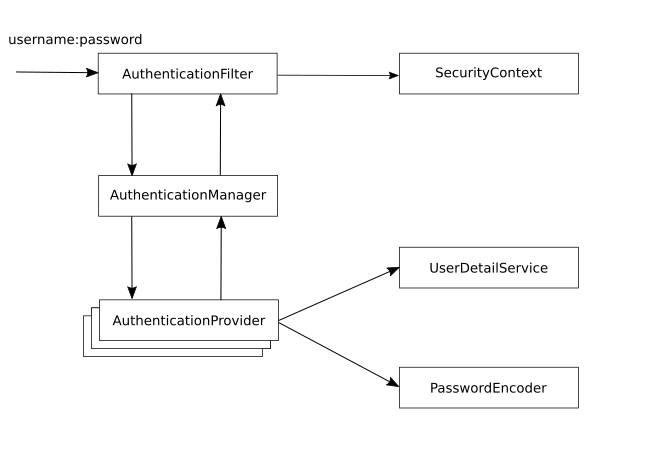
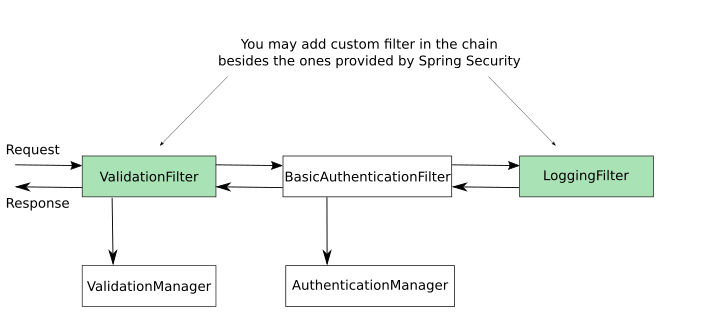
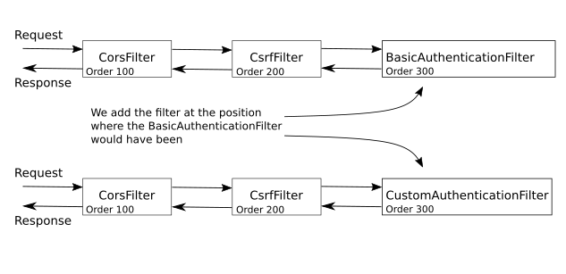
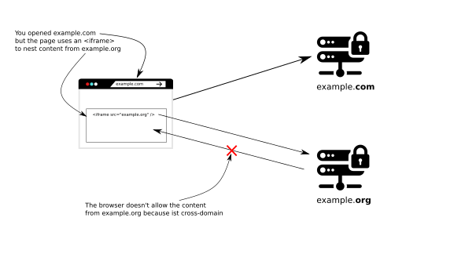
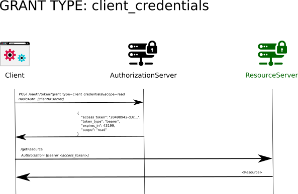

# Spring Security 

## TOC
- [Lesson 1 - The basic contracts](./LESSON-01_The-basic-contracts.md)
- [Lesson 2 - Implementing a UserDetailsServcie](./LESSON-02_Implementing-a-UserDetailService.md)
- [Lesson 3 - UserDetailsManager and PasswordEncoder](./LESSON-03_UserDetailsManager-and-PasswordEncoder.md)
- [Lesson 4 - Replacing the AuthenticationProvider](./LESSON-04_Replacing-the-AuthenticationProvider.md)
- [Lesson 5 - The filter chain](./LESSON-05_The-filter-chain.md)
- [Lesson 6 - Multiple Authentication Providers - Part 1](./LESSON-06_Multiple-Authentication-Providers-Part-1.md)
- [Lesson 7 - Multiple Authentication Providers - Part 2](./LESSON-07_Multiple-Authentication-Providers-Part-2.md)
- [Lesson 8 - The Security Context](./LESSON-08_The-Security-Context.md)
- [Lesson 9 - CSRF (Cross-Site Request Forgery)](./LESSON-09_CSRF_(Cross-Site-Request-Forgery).md)
- [Lesson 10 - CORS (Cross-Origin Resource Sharing)](./LESSON-10_CORS-(Cross-Origin-Resource-Sharing).md)
- [Lesson 11 - OAuth 2 and Spring Security](./LESSON-11_OAuth-2-and-Spring-Security.md)
- [Lesson 12 - Deeply understanding the grant types](./LESSON-12_Deeply-understanding-the-grant-types.md)
- [Lesson 13 - Token implementations in OAuth 2 Systems](./LESSON-13_Token-Implementations-in-OAuth-2-Systems.md)
- [Lesson 14 - Using Opaque Tokens - Introspection](./LESSON-14_Using-Opaque-Tokens-Introspection.md)
- [Lesson 15 - Using Opaque Tokens - Blackboarding]
- [Lesson 16 - Using non-opaque tokens in Spring Security with JWT]
- [Lesson 17 - Using symmetric keys with JWT]
- [Lesson 18 - Using asymmetric key pairs with JWT]
- [Lesson 19 - Configuring the authorization server to expose the public key]
- [Lesson 20 - Using Keycloak as an authorization server]
- [Lesson 21 - Using the Spring Security DSL method to create the Resource Server]
- [Lesson 22 - Implementing Single Sign On (SSO)]
- [Lesson 23 - Configuring endpoint authorization]
- [Lesson 24 - Authorities, Roles and Matcher methods]
- [Lesson 25 - MVC matchers and ANT matchers]
- [Lesson 26 - Endpoint authorization rules for an OAuth2 resource server]
- [Lesson 27 - Method authorization configurations]
- [Lesson 28 - Preauthorization, postauthorization, prefiltering and postfiltering]
- [Lesson 29 - Using permissions]
- [Lesson 30 - @Secured and @RolesAllowed]
- [Lesson 31 - Securing reactive apps]
- [Lesson 32 - Building an OAuth 2 reactive resource server]
- [Lesson 33 - Integration testing for Spring Security implementations - Part 1]
- [Lesson 34 - Integration testing for Spring Security implementations - Part 2]


##Lesson 1 - The basic contracts

⭐ Timestamps ⭐
- 4:33 Spring boot project with Dependencies
- 17:44 Spring Security Architecture & Contracts
- 22:10 Sample Rest Controller w/ default spring boot configuration
- 29:00 HTTP Basic Auth / HTTP Authorization Header
- 43:00 Sample UserDetailsService Implementation
- 49:00 Sample PasswordEncoder Implementation

### Spring Architecture

When adding Spring Security to a project, simply by adding the dependency, Spring Boot Autoconfiguration will add
a security filter chain and secures an Appliaction with BasicAuthentication. The Username of the automatically created 
user is `user` and the password is generated and will be printed to the logs. 
Responsible for this is `org.springframework.boot.autoconfigure.security.servlet.UserDetailsServiceAutoConfiguration.class` 
that configures an `InMemoryUserDetailsManager` as `UserDetailService` and creates a new user from security properties
( Properties starting with "spring.security.) read by `org.springframework.boot.autoconfigure.security.SecurityProperties.class`
.


Autoconfiguration is also responsible for creating a DefaultSecurityFilterChain with a BasicAuthenticationFilter.





_AuthenticationFilter_: `org.springframework.security.web.authentication.www.BasicAuthenticationFilter.class`

_AuthenticationManager_: `org.springframework.security.authentication.ProviderManager.class`

_AuthenticationProvier_: `org.springframework.security.authentication.dao.DaoAuthenticationProvider.class` 
             extends `org.springframework.security.authentication.dao.AbstractUserDetailsAuthenticationProvider.class`

_UserDetailService_: `InMemoryUserDetailsManager.class`

_PasswordEncoder_: `NoOpPasswordEncoder`


The Autoconfiguration will back off if one of the following classes are on the classpath  
- AuthenticationManager.class, 
- AuthenticationProvider.class, 
- UserDetailsService.class, or 
- AuthenticationManagerResolver.class

or one of the following types are available from the context
- org.springframework.security.oauth2.jwt.JwtDecoder,
- org.springframework.security.oauth2.server.resource.introspection.OpaqueTokenIntrospector, 
- org.springframework.security.oauth2.client.registration.ClientRegistrationRepository

### Override Security Configuration

Configuration can be overridden with a configuration file and `UserDetailsServiceAutoConfiguration` will back off if an
UserDetailService is provided by the application. 


A class implementing the `UserDetailsService` contract has to provide UserDetails, another contract that provides core
user information. 

A user in Spring Security a user object has to follow the `UserDetails` contract. All the `is....` methods of that class 
return `true` if the account is valid. Otherwise the methods return `false`

It's not sufficient to create a user with a password. The password has to be encoded. Therefore you either have
to provide a bean that implements `PasswordEncoder` contract or add an encoding hint (encodingId) to the password,
e.g. _"{noop}SuperSavePwd"_.   


```java
public interface UserDetails extends Serializable {

	/**
	 * Returns the authorities granted to the user. Cannot return <code>null</code>.
	 */
	Collection<? extends GrantedAuthority> getAuthorities();

	/**
	 * Returns the password used to authenticate the user.
	 */
	String getPassword();

	/**
	 * Returns the username used to authenticate the user. Must return <code>null</code>.
	 * @return the username (never <code>null</code>)
	 */
	String getUsername();

	/**
	 * Indicates whether the user's account has expired. An expired account cannot be authenticated.
	 * @return <code>true</code> if the user's account is valid (ie non-expired),
	 * <code>false</code> if no longer valid (ie expired)
	 */
	boolean isAccountNonExpired();

	/**
	 * Indicates whether the user is locked or unlocked. A locked user cannot be
	 * authenticated.
	 * @return <code>true</code> if the user is not locked, <code>false</code> otherwise
	 */
	boolean isAccountNonLocked();

	/**
	 * Indicates whether the user's credentials (password) has expired. Expired
	 * credentials prevent authentication.
	 * @return <code>true</code> if the user's credentials are valid (ie non-expired),
	 * <code>false</code> if no longer valid (ie expired)
	 */
	boolean isCredentialsNonExpired();

	/**
	 * Indicates whether the user is enabled or disabled. A disabled user cannot be
	 * authenticated.
	 * @return <code>true</code> if the user is enabled, <code>false</code> otherwise
	 */
	boolean isEnabled();

}
```

##Lesson 2 - Implementing a UserDetailService

⭐ Timestamps ⭐
- 1:28 diagram
- 9:40 start coding
- 16:13 creating database tables
- 27:35 creating configuration class
- 30:13 implementation of UserDetailService
- 39:51 creating user that implements UserDetails


Created a `ProjectConfiguration`  with `UserDetailsService` and `PasswordEncoder` bean 
`UserDetailsService` is implemented by a `JPAUserDetailsService`.
The Service implements `UserDetailsService` and reads a User entity from the h2 database by its username.
There it uses UserDetailsRepository (a JpaRepository<User, Long>).
The user entity is wrapped by `AuthenticatedUser`. This wrapper provides the UserDetails contract. 

`AuthenticatedUser` return the name and the password of the wrapped user object. 

To get rid of the PasswordEncoder bean in the ProjectConfiguration it's possible to 
add the password encryptionId as a prefix to the users password in the `AuthenticatedUser.getPassword()` method.


##Lesson 3 - UserDetailsManager and PasswordEncoder 

⭐ Timestamps ⭐
- 1:26 Recap of Spring-security Architecture
- 6:45 Creating Spring boot project with Dependencies
- 11:21 Sample Controller
- 14:18 Spring java configuration for UserDetailsService and PasswordEncoder
- 18:07 Using JDBC UserDetailsManager(a type of UserDetailsService), Difference UserDetailsManager vs UserDetailsService
- 29:40 Creating Tables As needed by JDBCUserDetailsManager along with data
- 38:38 Using encrypted/hashed PasswordEncoder
- 41:50 Managing users(like creating user) using UserDetailsManager Contracts and new Controller
- 56:28 Why BCryptEncoder over other hashing algorithm (like MD5)

### Part 1 - Using the default JdbcUserDetailsManager

JdbcUserDetailsManager is a named Manager because of its role to manage users. 

In this lesson an instance of `JdbcUserDetailsManager` is used as UserDetailsService and one of `NoOpPasswordEncoder`
as PasswordEncoder. 

`JdbcUserDetailsManager` requires a database table name "users" with at least three columns "username", "password", and 
"enabled" Flag and authorities table with "username", and "authority" column to assign authorities to a user.

### Part 2 - Using an alternative PasswordEncoder

To be able to use another passwordEncoder the data from the database has to be created with an encrypted password.
This can be done by disabling CSRF and create a user by an unsecured endpoint 

To create a user with bcrypt password CSRF has to be disabled and the /user endpoint shouldn't be secured
You also have to extend the `WebSecurityConfigurerAdapter`. These changes apply to the `ProjectConfiguration`


## Lesson 4 - Replacing the AuthenticationProvider

⭐ Timestamps ⭐
- 1:00 Recap of Spring-security Architecture
- 7:00 Creating Spring boot project with Dependencies
- 16:00 Implementing Custom AuthenticationProvider, understanding Authentication interface contracts, Using Basic Authentication
- 31:30 How AuthenticationManager finds proper AuthenticationProvider
- 44:00 Config Class with AuthenticationProvider


In this lesson a custom AuthenticationProvider is implemented with its two methods.

### Understanding the AuthenticationProvider interface 

#### the authenticate(..) method

This method should implement a simple autentication logic:
If the request is authenticated then return a fully authenticated Authentication instance.
If the request is *not* authenticated then thow an AuthenticationException.
If the Authentication is not supported by this AuthenticationProvider then return **null**.


**fully authenticated* means that the Authentication instance returns true for  isAuthenticated()- method 
from it's interface. Fully authenticated Auth instances will be instanciated by the AuthenticationProvider.

#### the supports(...)   

This method gets the type of Authentication as parameter and checks if the AuthenticationProvider supports
the type of the current Authentication instance.

```java
    @Override
    public boolean supports(Class<?> authentication) {
        return UsernamePasswordAuthenticationToken.class.equals(authentication);
    }
```

The AuthenticationManager only calls the authenticate(...) method of the AuthenticationProvider 
if the supports(...)- method returns true.

### The Authentication interface

The Authentication instance contains all the details for the authentication including the credentials.
The credentials should be removed after a user/subject has been authenticated

Object getCredentials() -> The password. This may be a cryptographic key or something completely different
Object getDetails()     -> the details contain special information. E.g. this is used in the OAuht 2.0 authentication.
Object getPrinciple()   -> return the user/subject for this request and can return a `java.security.Pripncipal` instance 
getAuthorities()        -> returns a collection of privileges after sucessful authentication


HTTP Basic authentication uses UsernamePasswordAuthenticationToken.class


[Code for this lesson](https://github.com/lspil/youtubechannel/tree/master/ss-c4)

## Lesson 5 - The filter chain

⭐ Timestamps ⭐
- 1:00 Recap of Spring-security Architecture
- 4:30 Filter Chain Diagram
- 8:30 Creating Spring boot project with Dependencies
- 14:00 Custom Authentication Filter using Servlet Filter
- 24:00 Configure Authentication Manager in Config Class
- 34:20 Purpose of Security Context and what to store
- 36:15 Implementing Custom AuthenticationProvider
- 42:50 Configure Authentication Filter in Config Class & placement of filter wrt other filters
- 51:30 Proper http error response from Authentication Filter
- 53:00 Introduction - Custom Authentication Filter using spring security Filter class




This lesson starts with an overview over the filterchain and then starts with implementing a CustomAuthenticationFilter that implement the javax.servlet.Filter contract.
First thing is to cast the request parameter to a HttpServletFilter to get the authorization header from the 
Afterwards the authorization key has been extracted is encapsulated into an Authencation object and delegated to an AuthenticationManager
The `UsernamePasswordAuthenticationToken` is chosen (misused) as Authentication to not have to implement a complete Authentication 
class from scratch.


If authentication is successful the authentication has to be stored in the security context.



To add a filter to the Filterchain to have to overwrite the 
`WebSecurityConfigurerAdapter.configure(HttopSecurity httpSecurity)'` method and add the filter. 
A new filter can be added _before_, _after_ or at the position of another filter. 
If the position of a filter isn't important httpSecurity.addFilter(filter) method is sufficient, but that happens rarely.

But wait, there is room for import. Instead of defining a custom filter that implements `Filter` interface
it's possible to extend the `org.springframework.web.filter.OncePerRequestFilter. In this case no casting is needed 
an spring takes care that the ist is called only once per request. 


## Lesson 6 - Multiple Authentication Providers Part 1

⭐ Timestamps ⭐
- 0:30 Implementing Multi Factor Authentication(Basic & OTP Authentication)
- 26:50 Configuring Authentication Manager explicitly
- 50:00 Configuring Authentication Provides and Filters
- 58:00 Returning a token after Authentication


In this level a multi-level authentication (not MFA, because there are no differnt factors).
In the first step the user authenticates with username/password, then in the second step the user has to enter a 
one-time password (a token created from a UUID) for authentication.


1. Configure a database
2. Create User and an Otp Entities with according Repositories
3. Create a UserDetailsService and define a PasswordEncoder-Bean
4. Create a filter for User Authentication extending `OncePerRequestFilter`. In this Filter override , the 
   `doFilterInternal(...)`- method  will only be called, when the ServletPath starts with __/login__. Therefore you 
   have to override the `shouldNotFilter()`-method.
5. Create a AuthenticationProvider `CustomUsernamePasswordAuthFilter` for first part: Username and password authentication
6. if authentication is valid, create an Otp for the user and save it to the database in `CustomUsernamePasswordAuthFilter`. 
7. Create a AuthenticationProvider `CustomOtpAuthFilter` for second part: Username and password authentication;
8. Add Filter and Provider in WebSecurityConfiguration by overriding two `configure(...)` methods.
 
How to elaborate this lesson

- In addition to the lesson a timestamp is added to the OTP so it will expire after 30 seconds.
- OTP handling is done in the AuthenticationFilter, this should be extracted to an OTP Service or OTP Provider that generates
  a second factor.


## Lesson 7 - Multiple Authentication Providers Part 2

⭐ Timestamps ⭐
- 1:00 Recap of Spring-security Architecture
- 5:00 Implementing Authentication filter for resource APIs' using token
- 45:00 Adding Authentication to Security Context as End Step after Resource API is Authenticated

Lesson 7 continues to evolve the codebase from lesson 6 by adding an CustomTokenFilter and CustomTokenAuthenticationProvider.
The filter accesses the Authorization header from the HttpServletRequest and looks up, if a token exists.
If the token exists, the username AuthenticationProvider gets the username by the token and creates a new AuthenticationObject.
This Authentication is stored in the security context. 

How to elaborate this lesson

- Create a contract for the TokenStore and provide a more intelligent store.
- The token should exipre.


## Lesson 8 - The Security Context

⭐ Timestamps ⭐
- 17:30 Retrieving Authentication from Security Context in Resource API End point
- 24:00 Access Authentication via SecurityContextHolder
- 27:00 Threadlocal implementation of the SecurityContextHolder 
- 33:00 Security Context is ThreadLocal Mode by Default, How to change Mode , and other means to make context available across Threads

In Lesson 8 the authentication ios injected into a Controller. Spring knows how to take the Authentication object from the 
`SecurityContext` and injects it into spring managed components.
The details of the Authentication object can be accessed by the Principal contract.

??? _Can the Authentication only be injected in Controller class._ ???

Besides injection the Authentication object it is possible to access the object directly from the SecurityContext.
With `Authentication authentication = SecurityContextHolder.getContext().getAuthentication()` you can get the current
authentication object anywhere in the application. 

SecurityContextHolder uses a ThreadLocal implementation for holding the Authentication object. With the standard 
Spring MVC every request will be handled in its own thread. So the authentication will always be available. But if you 
use Spring WebFlux and work with reactive applications or use asynchonous processing in Controller classes (**@Async**), 
you don't have access to the Authentication out of the box.

(To enable Asynchronous processing you have to add the `@EnableAsync` Annotation to a configuration class).
To change this behaviour you have to change the strategy of the `SecurityContextHolder` to manage the SecurityContext.
`SecurityContextHolder` implements three different strategies to manage the SecurityContext. The default strategy
is **MODE_THREADLOCAL**, which stores a state or values only for the thread it belongs to.
Next is the **MODE_INERITABLETHREADLOCAL** propapates the properties to a new created thread that forke /spawned from the
original thread.

To use **MODE_INERITABLETHREADLOCAL** you have to set this, as is done in the configuration file with an `InitializingBean`.
An InitializingBean will be be of use to set the strategy before the first use.

```java
    @Bean
    public InitializingBean initializingBean() {
        return() -> {
            SecurityContextHolder.setStrategyName(
                    SecurityContextHolder.MODE_INHERITABLETHREADLOCAL);
        };
    }
```

Another way to set the strategy is by defining the configuration setting orsystem property `spring.security.strategy`.

By using **MODE_INERITABLETHREADLOCAL** strategy it also works when you create the thread on your own, as can be seen in 
the `TestController.helloThreaded()` method. 

It's even possible to delegate the SecurityContext without setting the  **MODE_INERITABLETHREADLOCAL** strategy. 
Therefore you can use either a DelegatingSecurityContextRunnable as in `TestController.helloThreadedWithDelegatingRunnable()`
or with a `TestController.helloThreadedWithDelegatingExecutorService()`

The preferred way is to yous @Async and @EnableAsync with some sort of configuration of the strategy.


```java
  DelegatingSecurityContextRunnable delegatingRunnable = new DelegatingSecurityContextRunnable(runnable);
 ```
```java
  ExecutorService delegatingExecutorService = new DelegatingSecurityContextExecutorService(executorService);
 ```


If you check the latest spring code for SecurityContextHolder, you can see that depending on the strategy you use, it 
either initializes a `ThreadLocalSecurityContextHolderStrategy` object or a `InheritableThreadLocalSecurityContextHolderStrategy` 
object which actually contains the `ThreadLocal<SecurityContext>`. 
The difference is that the `ThreadLocalSecurityContextHolderStrategy` object contains a plain `java.lang.ThreadLocal` and the 
`InheritableThreadLocalSecurityContextHolderStrategy` contains the `java.lang.InheritableThreadLocal` variable.

So, spring is basically using the java.lang.InheritableThreadLocal variable, which leads to the JVM itself to propogate 
the thread local variable to the child thread. This is the reason why you are able to access the authentication even when 
you create your own thread.

Possibly the `DelegatingSecurityContextRunnable` does the propogation on a regular ThreadLocal variable, so that you can 
selectively decide whether to propogate the context to the new thread.


This lesson continues where lesson 7 stopped. The 

## Lesson 9 - CSRF (Cross-Site Request Forgery)

⭐ Timestamps ⭐
- 2:00 CSRF example
- 16:00 
   1. CSRF Attack for CRUD operation by disabling csrf , 
   2. CSRF Token sent by Server on GET and validated for subsequent CUD operations 3.CSRF valid for Session Context
- 32:00 Adding a CSRF token to the web page
- 39:00 QA on how CSRF Attack Possible even with CSRF protection
- 42:00 Customize CSRF protection with a Customizer
- 48:00 Custom CSRF token Management using CSRF Repository
- 56:00 Spring Security CSRFFilter handles CSRF protection

Starting by a simple WebApplication with a login form, you will find an hidden html input element "_csrf"
The value assigned to this element is the CSRF token. 


```html
  ...
  <input name="_csrf" type="hidden" value="b51cb2ad-eabf-4f80-8c6c-9efb4da8dc9d">
  ...
```

It's very easy to disable the csrf token from a configuration class and overriding the configure method of the `WebSecurityConfigurerAdapter`.
After applying that configuration the html input element will be removed from the page and no CSRF Token will be checked any
more. The CSRF-Filter (`CsrfFilter`) will be removed from the filterchain.

```java
    @Override
    protected void configure(HttpSecurity http) throws Exception {
        super.configure(http);
        http.csrf().disable(); // !!! GENERALLY DO NOT DO THIS !!!
    }
```

After that it's easy to call a POST/PUT/DELETE Action on a spring Controller class and you can easily be tricked into 
executing action you don't want to by an malicious attacker. (see `malicious.html`).

That's the reason why in spring security the CSRF protection is enabled by default. 

So **never ever disable CSRF!**. At least until some other countermeasures are in place. (-> e.g. an OAuth 2 Token filter).

### How it works

Spring Security generates a random token and sends it with the reponse (html page).
When the user sends a request back to the server this token has to be part of the request data.
If the token is not available, the server refuses to process the request of the user.

So you have to add the CSRF token to the html pages where an action is taken.

```html
  <input type="hidden" th:name="${_csrf.parameterName}" th:value="${_csrf.token}" />
```

With this, it's not possible any more to call a request without the CSRF token.
The malicious page won't work any more.


### Configuring CSRF protection by a CsrfConfigurer

One thing you can do is to disable csrf for some pathes define by Ant Pattern.

```java
    protected void configure(HttpSecurity http) throws Exception {
        super.configure(http);
        http.csrf(configurer -> {
            configurer.ignoringAntMatcher("AntPattern 1", "AntPattern 2", ...); //
        });
    }
```

It's also possible to customize the Tokens management by defining your own CsrfTokenRepository.
`CsrfTokenRepository` is an interface that defines three methods:
- generateToken(HttpServletRequest req)
- saveToken(CsrfToken token, HttpServletRequest req, HttpServletResponse response)
- loadToken(HttpServletRequest req);

```java
    protected void configure(HttpSecurity http) throws Exception {
        super.configure(http);
        http.csrf(configurer -> {
            configurer.csrfTokenRepository( myTokenRepository() );
        });
    }
```

And by this you can create custom CsrfTokens. `CsrfTokens` is another interface that defines a header name, a parameter 
name and the token itself as a string. But it's best to use `DefaultCsrfToken` implemenation class, that's implemented
as a ValueObject and includes a header name, a parameter name (*_csrf* by default) and the 
token itself

By implementing a custom CsrfTokenRepository you can set the token to a fixed value, what's normally a bad idea. See 
`CustomCsrfTokenRepository` example.


### When not to use CSRF Protection

CSRF is not need for OAuth 2 Authorization. 

### Add a Filter for CsrfToken to log the tokens

You can easily to log the CsrfToken after it has been generated in the CsrfFilter 
by adding another filter after the `CsrfFilter`. See the `CustomCsrfTokenLoggerFilter` example.

See also: [Was ist CSRF (Cross-Site-Request-Forgery-Attack)?](https://www.ionos.de/digitalguide/server/sicherheit/was-ist-cross-site-request-forgery/)

## Lesson 10 - CORS (Cross-Origin Resource Sharing)

⭐ Timestamps ⭐
- 2:22 CORS
- 21:00 QA on Controller vs Rest Controller
- 28:00 what CORS can't protect as opp. to CSRF
- 35:00 How to relax CORS for some Origins
- 47:35 CORS Summary, It protects Client, not Server(ie Website2)

There are different ways to deal with Cross Origin Resource Sharing, but before diving into it. Here is the definition 
from wikipedia

_Cross-origin resource sharing (CORS) is a mechanism that allows restricted resources on a web page to be requested from another domain outside the domain from which the first resource was served._

When you try to access the same website with different addresses (, and this may only be an IP-Address and domain name for the same server)
you geht a CORS error message in the browser.


The reason for this is, that the Same-Origin-Policy is violated by the call to another website (or the same website with different addresses).

But this does not mean, that the method is not called! As can be seen by the POST- example in the `MainController`, the 
method is executed but the response of the message ist blocked by the server. 
So you won't get a server-side notification about CORS, because the user is allowed here to call the POST method, but the 
the browser reacts to the wrong call.
To stop the user from calling the method you shoud not disable CSRF Protection. 





### How to work around CORS errors

One way to allow a client to call a method, you can add a ***@CrossOrigin("\*")*** Annotation either to the controller 
class or a method in the controller class. That way the **Access-Control-Allow-Origin** Header. The star is a placeholder 
for all origins.

After adding the Annotation you will find the **Access-Control-Allow-Origin** Header in the browser response 

This option is not really very secure, handy and is by no means configurable. In a real world scenario you should be able
to configure the allowed origins.

A much better option is to configure CORS from the WebSecurityConfigurerAdapter with a custom configuration as you already
did with the CSRF configuration in the previous lesson.

```java
    http.cors( c-> {
        CorsConfigurationSource ccs = request -> {
            CorsConfiguration cc = new CorsConfiguration();
            cc.setAllowedMethods(List.of("GET", "POST", "PUT", "DELETE"));
            cc.setAllowedOrigins(List.of("*"));
            return  cc;
        };
    });
```
Bear in mind, that you have to set not only the **allowed origins** but also the **allowed methods**
With this configurer your also able to load the value from the properties or from environment values.

The  **allowed origins** should contain the address of origin the   

```java
    @Value("${chapter10.allowed.origins}")
    private List<String> allowedOrigins;

    http.cors( c-> {
        CorsConfigurationSource ccs = request -> {
            CorsConfiguration cc = new CorsConfiguration();
            cc.setAllowedMethods(List.of("GET", "POST", "PUT", "DELETE"));
            cc.setAllowedOrigins(allowedOrigins);
            return  cc;
        };
    });
```


See also: [CORS: Cross-Origin Resource Sharing erklärt](https://www.ionos.de/digitalguide/websites/web-entwicklung/cross-origin-resource-sharing-erklaert/)


## Lesson 11 - OAuth 2 and Spring Security

⭐ Timestamps ⭐
- 5:00 Oauth2 concept, Custom Authorization Server implementation
- 18:00 Start implementing  Authorization Server
- 27:30 Authorization Server client configuration
- 30:00 Client ID/Secret/Scope similar to User management
- 33:00 Oauth Grant Types - How Client fetches Token from Authorization Server on behalf of User
- 37:30 Authorization Server endpoint configuration.
- 45:00 What is bearer token?
- 47:00 Token implementation : Opaque token, JWT token
- 54:00 Authorization Code Grant Type 

### Notice  

Creating your own authorization server is a bit difficult because the old authorization server from the spring cloud project
from spring cloud project is deprecated for some time now and the new spring authorzation server is under development and 
doesn't work well. (At least there is no stable version for Spring Boot 2.6 )
There your best option is to use she authz server from spring cloud.

So you have to provide the pom management for `spring-cloud-dependencies` and use correct release for the Spring Boot version
(here Spring Cloud Release Train 2021.0.x aka Jubilee for Spring Boot version 2.6.x )

```xml 
    <dependencies>
    
        ...
            
        <dependency>
            <groupId>org.springframework.cloud</groupId>
            <artifactId>spring-cloud-starter-oauth2</artifactId>
            <version>2.2.0.RELEASE</version>
        </dependency>
    </dependencies>

    <dependencyManagement>
        <dependencies>
            <dependency>
                <groupId>org.springframework.cloud</groupId>
                <artifactId>spring-cloud-dependencies</artifactId>
                <version>2021.0.1</version>
                <type>pom</type>
                <scope>import</scope>
            </dependency>
        </dependencies>
    </dependencyManagement>
```

### Password grant type

To get started with the, the following image shows the password grant type


With the password grant type the username and password will be provided to the client, and the client uses the credentials
to authenticate the user with the authorization server. The Authorziation Server provides the client with a token, when
the credentials are valid to identify the user.  
The password grant type is only applicable for non-public clients, because the client knows the credentials!


### Configuration of http authentication   

Implementation starts with extending WebSecurityConfigurerAdapter and provide  in Memory usermanagement for default authentication.
Hence you implement a UserDetailsServer and PasswordEncoder (as above).

### Configuration of Authorization Server for Password Grant Type

Similar to using the WebSecurityConfigurerAdapter you begin with extending the AuthorizationServerConfigurerAdapter
and override two of three `configure()` methods. One for the client details and one for the 
authorization endpoints to plug in the AuthenticationManager and use the web security configuration as for a simple web application.


```java
@Configuration
@EnableAuthorizationServer
public class AuthServerConfig extends AuthorizationServerConfigurerAdapter {

    @Override
    public void configure(ClientDetailsServiceConfigurer clients) throws Exception {
        clients.inMemory(). 
            ...
            .build();
    }

    @Override
    public void configure(AuthorizationServerEndpointsConfigurer endpoints) throws Exception {
        endpoints.authenticationManager(authenticationManager);
    }
}
```
### Configuration of ClientDetails

As with UserDetailsService there as similiar possibilities to implement ClientDetailsService to create a 
service that manages `ClientDetails`.

The most important Properties for a client to use password Grant type are :

```java
    clients.inMemory()
        .withClient("client1")
        .secret("secret1")
        .scopes("read")
        .authorizedGrantTypes("password") 
```


Clients are specified in an `ClientDetails` object that is best done by a `ClientBuilder` that can be retrieved from 
`ClientDetailsServiceBuilder`´s  `withClient( String clientId)` method.

Here you find a list of properties/details for a clien.  
```java
    private final String clientId;
    private String secret;
    private Collection<String> authorizedGrantTypes;
    private Collection<String> authorities;
    private Integer accessTokenValiditySeconds;
    private Integer refreshTokenValiditySeconds;
    private Collection<String> scopes;
    private Collection<String> autoApproveScopes;
    private Set<String> registeredRedirectUris;
    private Set<String> resourceIds;
    private boolean autoApprove;
    private Map<String, Object> additionalInformation;
```

### Configuring the endpoint

Next step after configuring the ClientDetails is the configuration of the endpoint, therefore the authentication manager is 
supplied to the endpoint for authorization. 

After this final step you can start the application, that provides us with a few endpoint, that can be used by clients.
- **/oauth/token**: The endpoint to retrieve a token 
- /**oauth/token_key**: The endpoint to retrieve a public key for signed token by a asymetric key algorithm
- **/oauth/check_token**: The endpoint to validate a token (aka introspection endpoint)

### Test authentication

To test authentication you can use Postman. Start the server and send a POST request to the **/oauth/token** endpoint  
You also have to set the _clientId_ and _secret_ as basic authentication parameters to the server
 
```
    http://127.0.0.1:8080/oauth/token?grant_type=password&username=john&password=12345&scope=read
```

For the password grant type you have to provide the following request parameter

| Parameter | Description | Mandatory |
| --------- | ----------- | --------- |
| grant_type| name of the grant type  | YES       |
| username  | username  | YES       |
| password  | password  | YES       |
| scope     | authentication scope of the client    | YES       |

After executing that request you get a json object with the token. This token is opaque and just used to identify the 
authenticated user. There is no data provided with this token as it's possible with JsonWebTokens. 
Here it's a simple uuid assigned to the authentication. 
The token  has a type (here **bearer**) and expires after a given time in second and you can use this token to access the 
resource server. By providing the token to the resource server it allows you to do all the things that are allowed to done
in the scope of this token.

```json
{
    "access_token": "37c94c18-486f-46c5-9223-201425228163",
    "token_type": "bearer",
    "expires_in": 43117,
    "scope": "read"
}
```

The bearer token is directly provided to any client that knows the **clientId** and **secret** and the 
**username** and **password** of the user. So this grant type should not be used any more and will be deprecated in OAuth 2.1

### Authorization code grant type

With the Authorization code grant type the user tries to access a secured resource and will be redirected to an 
authoriziaton server. Redirection is done from the client via the user to the Authorzation server, where the user 
can login, e.g. by providing a username and a password. 
But how can the authorization server provide a token to the client? This has to be done by a **redirect URI** that can be 
configured in the client details.

The Authorization code grant type is more secure than the passwort grant type


### Configuration of Authorization Server for Authorization Code Grant Type

To enable AuthCode Grant Type you have to provide another ClientDetails for this grant type. 
In additon to the Passwortd Grant Type the redirectUris should point to the client for exchange of the auth code with a 
token. 

```java
    clients.inMemory()
        .withClient("client2")
        .secret("secret2")
        .scopes("read")
        .authorizedGrantTypes("authorization_code")
        .redirectUris("http://localhost:9090");
```

Also the auth server application should provide a login form so the  user can enter its credentials.
Therefore the `configure(HttpSecurity)` method of the WebSecurityConfigurerAdapter has to be overridden as below.

```java
    @Override
    protected void configure(HttpSecurity http) throws Exception {
        http.formLogin();
        http.authorizeRequests().anyRequest().authenticated();
    }
```

#### Step 1: opens a login page

```
http://127.0.0.1:8080/oauth/authorize?response_type=code&client_id=client2&scope=read&redirect_uri=http://localhost:8080/auth-code
```

Open the link in a browser and login with your credentials. After authentication you will see a consent page. When consent is given
by the user / resource owner, then the Authorization Code is sent to the client address defined in the redirect url.

|   parameter   | value | required |
|---------------|------ | -------- |
| response_type | **code**  |  YES |
| client_id     | the client id as defined | YES | 
| scope         | the requested scope | YES (?) |
| redirect_uri  | client url to sent the auth code to | YES |


#### Step 2: exchange auth code for token (Seems to be wrong)
```
http://127.0.0.1:8080/oauth/token?grant_type=authorization_code&scope=read&code={authCode}&redirect_uri=http://localhost:8080/auth-code
```

When the user is authenticated the authorization code is sent to the client and it can exchange the code for a token. 
For this request the same parameters have to be provided as for the initial call to the authorization server in Step 1.

The client has also to authenticate with clientId and Secret to the authorziation server. 
That makes this grant type more secure than the **Implicit** Grant Type where the access token is directly send to the 
client after the user has authenticated with the authorization server.

|   parameter   | value | required |
|---------------|------ | -------- |
| grant_type    | **authorization_code**   |  YES |
| client_id     | the client id as defined | YES | 
| scope         | the requested scope      | YES (?) |
| redirect_uri  | client url from the previous request | YES |


**_NOTE_**

The consent request can be deactivated by setting the scopes to autoApproved

```java
    clients.inMemory()
        .withClient("client2")
        .secret("secret2")
        .scopes("read")
        .autoApproved("read")
        .authorizedGrantTypes("authorization_code")
        .redirectUris("http://localhost:9090");
```

**_ATTENTION_**

For ease of use CSRF is disabled in this example.


## Lesson 12 - Deeply understanding the grant types

⭐ Timestamps ⭐
- 5:21 Password Grant type Sequence Diagram
- 14:00 QA on OpenID connect
- 22:00 Authorization Code Grant type Sequence Diagram
- 37:00 Client Credentials Grant type Sequence Diagram
- 44:00 Refresh Token- Solution for expired access_token
- 55:00 Simple changes to replace opaque with jwt token 


In this lesson all the necessary grant types are explained and coded. While **authorization code** and  **password (resource owner)** 
grant types have already been implemented in the previous lesson, here the configuration for 
the **client credentials** grant type and the **refresh token** grant type are explained.

#### Client Credentials grant type

The client credentials grant type allows a service to request a token to access a resource server. 
A good example for this is, when a environmental service like in kubernetes is executing a readyness probe or a liveness 
probe on an applicaton to see if it is already (readyness) / still (liveness) working.

There is no user involed in this process So it should only be used in secured environments.



To enable Client Credentials Grant Type you have to provide another ClientDetails for this grant type.
This client is similar to the Password Grant Type, except the authorizedGrantType() settings.

```java
    clients.inMemory()
        .withClient("client2")
        .secret("secret2")
        .scopes("read")
        .authorizedGrantTypes("client_credentials");
```

To get a token for the client you have to post a request to the authorization server.
You also have to provide the _clientId_ and _secret_ as basic authentication parameters to the server call. 

Step 1: post
```
http://127.0.0.1:8080/oauth/authorize?grant_type=client_credentials&scope=read
```

#### Refresh Token Grant Type

The Refresh Token Grant Type allows to get a new token from the Authorization Server in case the used token is going to 
expire. This Grant Type expects an existing token and only makes sense with a grant type where a user is involved, like **Password Grant Type** or 
**Authorization Code Grant Type**.

To enable Client Credentials Grant Type you have to enhance an existing ClientDetails Grant Type simply by adding 
"refresh_token" to the `authorizedGrantTypes()` settings.

```java
    clients.inMemory()
            .withClient("client2")
            .secret("secret2")
            .scopes("read")
            .authorizedGrantTypes("password", "refresh_token");
```

You also have to configure the UserDataService for the endpooint because it is not taken from the context, even when the 
UserDetailsService is already provided as a bean. !!!

```java
    @Override
    public void configure(AuthorizationServerEndpointsConfigurer endpoints) throws Exception {
        endpoints.authenticationManager(authenticationManager)
                .userDetailsService(userDetailsService);
```

When you authorize with and authorization server and the client also has the Refresh Token Grant Type, then the 
response will contain a **Refresh Token**.


```json
{
    "access_token": "5a9bbbba-0e30-43e5-a343-e4386a7b666b",
    "token_type": "bearer",
    "refresh_token": "6720220c-342a-40b7-9005-a89cad0e51b8",
    "expires_in": 43200,
    "scope": "read"
}
```

For token refresh you have to provide data  

#### Step 1: exchange refresh token for a new  token 
```
http://127.0.0.1:8080/oauth/token?grant_type=refresh_token&scope=read&refresh_token=720220c-342a-40b7-9005-a89cad0e51b8
```

When the user is authenticated the authorization code is sent to the client and it can exchange the code for a token.
For this request the same parameters have to be provided as for the initial call to the authorization server in Step 1.

The client has also to authenticate with clientId and Secret to the authorziation server.
That makes this grant type more secure than the **Implicit** Grant Type where the access token is directly send to the
client after the user has authenticated with the authorization server.

|   parameter   | value | required |
|---------------|------ | -------- |
| grant_type    | **refresh_token**   |  YES |
| scope         | the requested scope      | YES |
| refresh_token  | the refresh token provided by the authorization request | YES |


### Replacing the opaque token with a JWT token  --- JWT Teaser

To replace the te opaque token with a JWT token, you only have to set a JwtAccessTokenConverter().
By providing  the Jwt access token converter as Bean Spring will automatically initialize a JwtTokenStore as TokenStore 
instance and replace the default tokenstore. By default an `InMemoryTokenStore` is used. With that store a  
`DefaultAuthenticationKeyGenerator` will be instanciated, that creates an MD5 has from username, clientId and the requested 
scopes of the authenticated user (Authentication object).

The TokenStore and the AccessTokenConverter can be provided as Beans to the Context and should be supplied to the
`AuthorizationServerEndpointsConfigurer`.

```java
  
    @Bean
    public TokenStore tokenStore() {
        return new JwtTokenStore(converter());
    }

    @Bean
    public JwtAccessTokenConverter converter(){
        return new JwtAccessTokenConverter();
    }
    @Override
    public void configure(AuthorizationServerEndpointsConfigurer endpoints) throws Exception {
        endpoints.authenticationManager(authenticationManager)
                .tokenStore(tokenStore())
                .accessTokenConverter(converter());
    }

```


## Lesson 13 - Token implementations in OAuth 2 systems

⭐ Timestamps ⭐
- 1:00 QA on implicit vs Authorization Code Grant type
- 16:00 What is an opaque token 
- 20:00 Opaque Token Implementation & How Resource server valdiates Opaque Token
- 32:40 How to configure Different password encode for Client credentials(Different than User credentials)
- 40:22 How to configure Access Token expiry time
- 41:00 Validate the Access Token
- 51:00 Blackborading Access Token
- 55:00 How Resource server valdiates Opaque Token
- 01:04:00 Introduction of JWT

### Opaque Token
#### What is a opaque token

An opaque token is a token that doesn't have any kind of information in it. In that way it is like a password: a string 
that authenticates a user, but with any details about it's usage or any other details.   
To gain details about the user and the scope of the the token, the receiving party has to get the details from somewhere 
else like the authorzation server. 

The default token generated by the system looks like a UUID but indeed is an MD5 hash over some data provided for 
authorization. 

### Token Validation

Token validation is the process of validating a token that has been presented to resource server.  

#### Validation of opaque token

There are two options for Token validation. One is to ask the authorization service if the access token is valid. This 
option is called **token introspection**.

The other option is called **token blackboarding** and it is to use a shared database for the access tokens. The 
authorization service stores a token in the database and the resource server can also access the database and can verify 
that the token is valid. One possible solution to this scenario is Redis as a high speed cache solution, that stores the 
token. This can be implemented by using a JDBC Token Store shared between authorization and resource server. 

There is also a third option, when authorization server and resource server are the same application. In this scenario
the same application shows up in two different roles.  

#### Token validation with token introspection endpoint  

The "oauth/check_token" endpoint is secured so you can't access this endpoint right way. You have to enable access to this
endpoint, otherwise any request is denied with 401.

You can set a web security expression to the `AuthorizationServerSecurityConfigurer.checkTokenAccess()` to enable that 
endpoint. 
```java
@Override
    public void configure(AuthorizationServerSecurityConfigurer security) throws Exception {
        security.checkTokenAccess("isAuthenticated()"); // isAuthenticated()
    }
```

Following web security expressions can be used:  
- _hasRole_, _hasAnyRole_
- _hasAuthority_, _hasAnyAuthority_
- _permitAll_, _denyAll_
- _isAnonymous_, _isRememberMe_, _isAuthenticated_, _isFullyAuthenticated_
- _principal_, _authentication_
- _hasPermission_

See [Web Security Expressions](https://www.baeldung.com/spring-security-expressions) for a description.

```java
    public void configure(AuthorizationServerSecurityConfigurer security) throws Exception {
        security.passwordEncoder(passwordEncoder);
    }
```

After enableing access to the endpoint you can call the endpoint with the token to see if it is valid

```java
    http://127.0.0.1:8080/oauth/check_token?token=3ba1f54e-0425-4a18-ba15-86a10a4750c1
```

When the token is valid, you get a json object with information about the user that contains it's name, scopes, and expiry time. 

```json
{
    "active": true,
    "exp": 1647103708,
    "user_name": "john",
    "authorities": [
        "read"
    ],
    "client_id": "client1",
    "scope": [
        "read"
    ]
}
```
If the token is not valid you may see the following message. 
```json
{
"error": "invalid_token",
"error_description": "Token was not recognised"
}
```
If the token is expired you see a message like this one.
```json
{
  "error": "invalid_token",
  "error_description": "Token has expired"
}
```

### Implementing Resource and Authorization Server as one application

To do this you have to add a `ResourceServerConfiguration` and implement a controller, 


**NOTE***

If you use a password encoder different from NoOpPasswordEncoder you have to encrypt the passwords 
in the client configuration.

```java
    @Override
    public void configure(ClientDetailsServiceConfigurer clients) throws Exception {
        clients.inMemory()
            .withClient("client1")
            .secret(
                    passwordEncoder.encode("secret1")
            )
        ...
    }
```

Therefore you have to configure the password encoder with the `AuthorizationServerConfigurerAdapter`

```java
    public void configure(AuthorizationServerSecurityConfigurer security) throws Exception {
        security.passwordEncoder(passwordEncoder);
    }
```

### JWT type Token

JWT contains already a lot of information and ist can be proved to be valid without accessing another server. 
The token itself contains information about the user, expiration and many other data supplied by so called claims.

These tokens are signed by the authorization server and can be proved valid when the resource server has a the key to
check the token signature. 


## Lesson 14 - Using Opaque Tokens - Introspection

⭐ Timestamps ⭐
- 1:30 Recap: Difference Opaque Token / JWT 
- 5:00 Recap: Authorization Server configuration with included Resource Server
- 12:30 Update for making the Refresh_token endpoint work
- 19:00 Setting up the Authorization Server - With a client details configuraiton for the resource server
- 27:30 Test Authorization Server
- 30:00 Setting up the Authorization Server
- 47:40 TokenStore Configuration

In this lesson a full authorization server and a resource server will be configured as two applications. 
As enhancement you need to configure a ClientDetails configuration for the resource server to access the 
introspection endpoint of the authorization server.

Configuration is the same as in the previous lessons.  


## Lesson 15 - Using Opaque Tokens - Blackboarding

[Code for this lesson](https://github.com/lspil/youtubechannel/tree/master/ss-c15-as)

## Lesson 16 - Using non-opaque tokens in Spring Security with JWT

⭐ Timestamps ⭐
- 3:00 Persist Client credentials in DB
- 43:00 Non-Opaque JWT Token Implementation
- 45:00 TokenStore and JWTTokenStore
- 47:30 Signing JWT Token by Auth Server
- 49:40 Why called Json web token(Base Encoding of a JSON string)
- 55:45 Symmetric Key for JWT Token Signing

[Code for this lesson](https://github.com/lspil/youtubechannel/tree/master/ss-c16)

## Lesson 17 - Using symmetric keys with JWT

## Lesson 18 -  Using asymmetric key pairs with JWT

[Code for the lesson](https://github.com/lspil/youtubechannel/tree/master/ss-c18-as)

## Lesson 19 - Configuring the authorization server to expose the public key

[Code for the lesson 1 Auth Server](https://github.com/lspil/youtubechannel/tree/master/ss-c19-as) and
[Code for the lesson 2 Resource Server](https://github.com/lspil/youtubechannel/tree/master/ss-c19-rs)

## Lesson 20 - Using Keycloak as an authorization server

[Code on GitHub](https://github.com/lspil/youtubechannel/tree/master/ss-c20)

## Lesson 21 - Using the Spring Security DSL method to create the Resource Server


## Lesson 22 - Implementing Single Sign On (SSO)


## Lesson 23 - Configuring endpoint authorization

## Lesson 24 - Authorities, Roles and Matcher methods

[Code on GitHub](https://github.com/lspil/youtubechannel/tree/master/ss-c24)

## Lesson 25 - MVC matchers and ANT matchers

Code on GitHub: https://github.com/lspil/youtubechannel/tree/master/ss-c25

## Lesson 26 - Endpoint authorization rules for an OAuth2 resource server

⭐ Timestamps ⭐
- 4:00 End points Authorization at Authorization Server Implementation
- 28:00 End points Authorization at Resource Server Implementation
- 43:00 End points Authorization at Resource Server (using new DSL server) , New DSL vs Legacy Spring Oauth

## Lesson 27 - Method authorization configurations

## Lesson 28 - Preauthorization, postauthorization, prefiltering and postfiltering

Code on GitHub: https://github.com/lspil/youtubechannel/tree/master/ss-c28

## Lesson 29 - Using permissions

Code on GitHub: https://github.com/lspil/youtubechannel/tree/master/ss-c29

## Lesson 30 - @Secured and @RolesAllowed

## Lesson 31 - Securing reactive apps

## Lesson 32 - Building an OAuth 2 reactive resource server

## Lesson 33 - Integration testing for Spring Security implementations - Part 1

## Lesson 34 - Integration testing for Spring Security implementations - Part 2

## Useful Links

### Must Read
###Micro-Services Architecture With Oauth2 And JWT - Kaper.com
[Part 1 – Overview](https://www.kaper.com/cloud/micro-services-architecture-with-oauth2-and-jwt-part-1-overview/)
[Part 2 – Gateway](https://www.kaper.com/cloud/micro-services-architecture-with-oauth2-and-jwt-part-2-gateway/)
[Part 3 – IDP](https://www.kaper.com/cloud/micro-services-architecture-with-oauth2-and-jwt-part-3-idp/)
[Part 4 – Oauth2/Scopes](https://www.kaper.com/cloud/micro-services-architecture-with-oauth2-and-jwt-part-4-oauth2-scopes/)
[Part 5 – From Legacy Monolith to Services](https://www.kaper.com/cloud/micro-services-architecture-with-oauth2-and-jwt-part-5-from-legacy-monolith-to-services/)
[Part 6 – Oauth2 and Web](https://www.kaper.com/cloud/micro-services-architecture-with-oauth2-and-jwt-part-6-oauth2-and-web/)

### Informativ

[IAM for dummies: Hands-on with OIDC](https://everything1know.wordpress.com/2019/09/10/iam-for-dummies-hands-on-with-oidc/)
[IAM for dummies: IAM for dummies: How does OAuth work](https://everything1know.wordpress.com/2019/05/19/iam-for-dummies-how-does-oauth-work/)
[IAM for dummies: OAuth 2 Grant Types](https://everything1know.wordpress.com/2019/06/01/iam-for-dummies-oauth-2-grant-types/)

